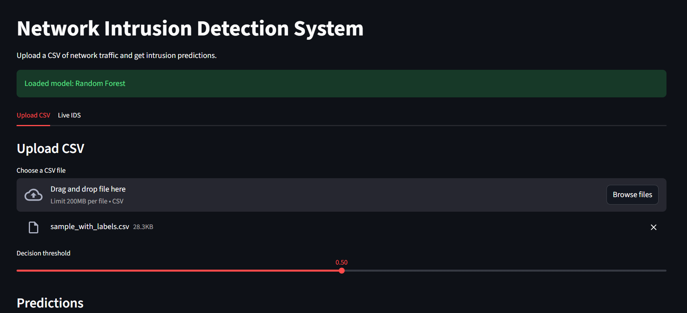
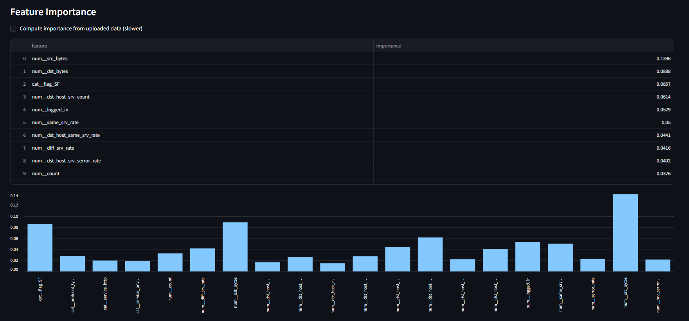
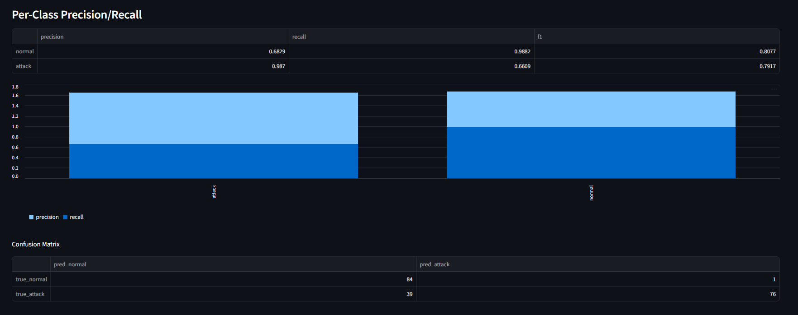

# Network Intrusion Detection System (NIDS) Using Machine Learning

     


End-to-end Network Intrusion Detection System using machine learning in Python. It downloads NSL-KDD automatically, trains multiple models, selects the best, and supports batch prediction, a Streamlit UI, and live IDS modes (CSV, Windows Sysmon, Zeek, Suricata).

**What This Project Does**
- Downloads and prepares NSL-KDD
- Trains multiple models with preprocessing and tuning
- Chooses the best model and saves it
- Generates reports and plots
- Provides batch prediction and a Streamlit app
- Supports live IDS ingestion (CSV, Windows Sysmon, Zeek, Suricata)

**Project Structure**
- `data/` NSL-KDD data files (auto-downloaded)
- `notebooks/` Step-by-step Jupyter notebook
- `src/` Training, preprocessing, prediction, live IDS code
- `models/` Saved best model
- `reports/` Metrics, plots, and live alerts

## Requirements
- Windows 10/11
- Python 3.9+ (recommended 3.10+)

## Setup
```
powershell
python -m venv .venv
.venv\Scripts\activate
python -m pip install --upgrade pip
python -m pip install -r requirements.txt
```

## Train the Model (One-Time)
```
powershell
python -m src.train
```
This generates:
- `models/best_model.joblib`
- `reports/metrics.csv`, `reports/metrics.json`
- `reports/metrics_comparison.png`, `reports/confusion_matrix_best.png`
- `reports/feature_importance.csv`, `reports/feature_importance.png`
- `reports/calibration_metrics.json`
- Optional: `models/best_model.onnx`, SHAP outputs

## Batch Prediction (CSV)
```
powershell
python -m src.predict --input data\sample_input.csv --output reports\predictions.csv
```
Optional:
```
powershell
python -m src.predict --input data\sample_input.csv --output reports\predictions.csv --threshold 0.4 --summary reports\summary.json
```
Output columns:
- `prediction` (0 = normal, 1 = attack)
- `prediction_label` (`normal` or `attack`)
- `prediction_score` (if available)

## Streamlit App
```
powershell
python -m streamlit run app.py
```
The app has two tabs:
- **Upload CSV** for prediction and metrics
- **Live IDS** to start/stop live modes

## Screenshots
Upload CSV and model status:


Predictions table and distribution:


Per-class precision/recall and confusion matrix:


Feature importance:


## Labeled Sample CSV (for precision/recall in the app)
```
powershell
python -c "import pandas as pd; from src.config import COLUMNS; df = pd.read_csv('data/KDDTest+.txt', names=COLUMNS, header=None); df.head(200).to_csv('data\\sample_with_labels.csv', index=False); print('Wrote data\\sample_with_labels.csv')"
```

## Live IDS Modes
All live modes use the same trained model (`models/best_model.joblib`). Run one mode per terminal. You can also start them from the **Live IDS** tab in the app.

### Option A: Live CSV (NSL-KDD columns)
Tail a CSV that already has NSL-KDD feature columns.
```
powershell
python -m src.live_csv --input C:\path\to\live.csv --output reports\live_predictions.csv
```

### Option B: Windows Sysmon (Event ID 3)
Requires Sysmon to be installed and logging network connections.
```
powershell
python -m src.live_windows --channel "Microsoft-Windows-Sysmon/Operational" --event-id 3 --output reports\live_alerts_sysmon.csv --start-at-end
```
Notes:
- If the Sysmon channel does not exist, Sysmon is not installed.
- This mode is optional. If you do not want Sysmon, use Zeek or Suricata instead.

### Option C: Zeek conn.log
Tail Zeek flow logs (`conn.log`).
```
powershell
python -m src.live_ids --log C:\path\to\conn.log --output reports\live_alerts.csv
```

### Option D: Suricata eve.json
Tail Suricata flow events in `eve.json`.
```
powershell
python -m src.live_suricata --log C:\path\to\eve.json --output reports\live_alerts_suricata.csv
```

**Important**
- Live Zeek/Suricata modes use an approximate mapping to NSL-KDD features.
- For production-grade detection, retrain the model on your own flow data.

## Notes
- Training is required only once. Re-train if you change models or data.
- The app does not change the trained model.
- If optional packages (SHAP/ONNX) fail to install, training still works; exports will be skipped.

